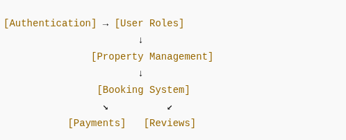

# Airbnb Clone – Features & Functionalities

This document outlines the core backend features of the Airbnb Clone project.

## Core Modules

1. **Authentication**
   - User registration and login
   - Password security and hashing
   - Role management

2. **Property Management**
   - Host CRUD operations
   - Property search and listings

3. **Booking System**
   - Guest bookings
   - Status updates (pending, confirmed, canceled)

4. **Payments**
   - Integrated with Stripe, PayPal, or credit cards
   - Stores payment details per booking

5. **Reviews**
   - Guest reviews after stay
   - 1–5 star ratings

6. **Messaging**
   - Host-guest conversations
   - Secure, timestamped threads

7. **Admin Controls**
   - Full database visibility
   - Ability to deactivate or manage users and listings

## Diagram

Refer to the image below for a visual breakdown:

