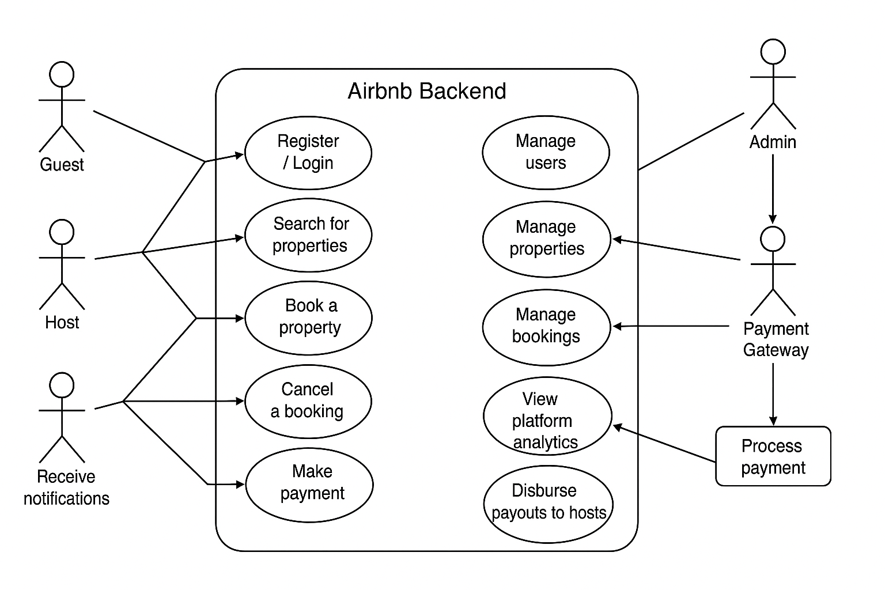

# Airbnb Clone – Use Case Diagram

This diagram visualizes the key interactions between users (guests, hosts, admins) and the backend system for the Airbnb Clone project.

## Actors

- **Guest**: Can search, book, and review properties.
- **Host**: Can manage property listings and bookings.
- **Admin**: Monitors and manages all data.
- **Payment Gateway**: External service for payment processing.

## Diagram

